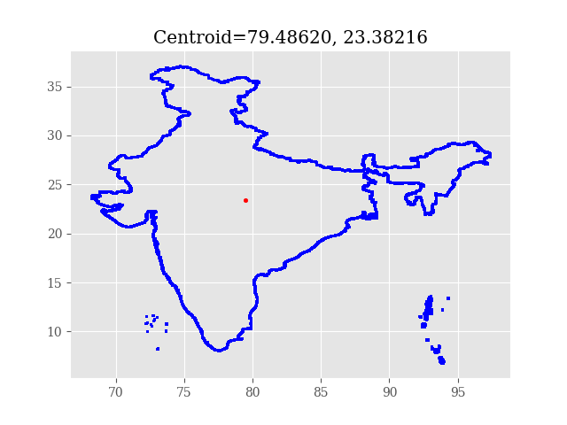
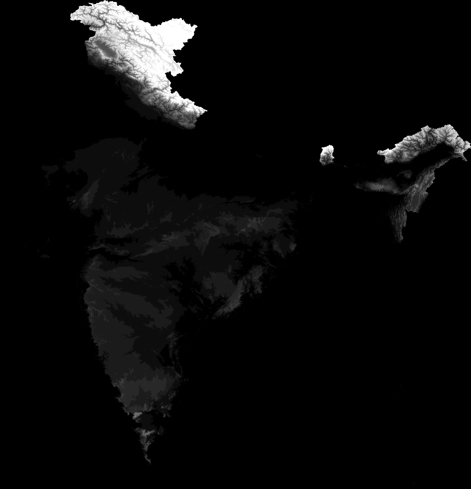
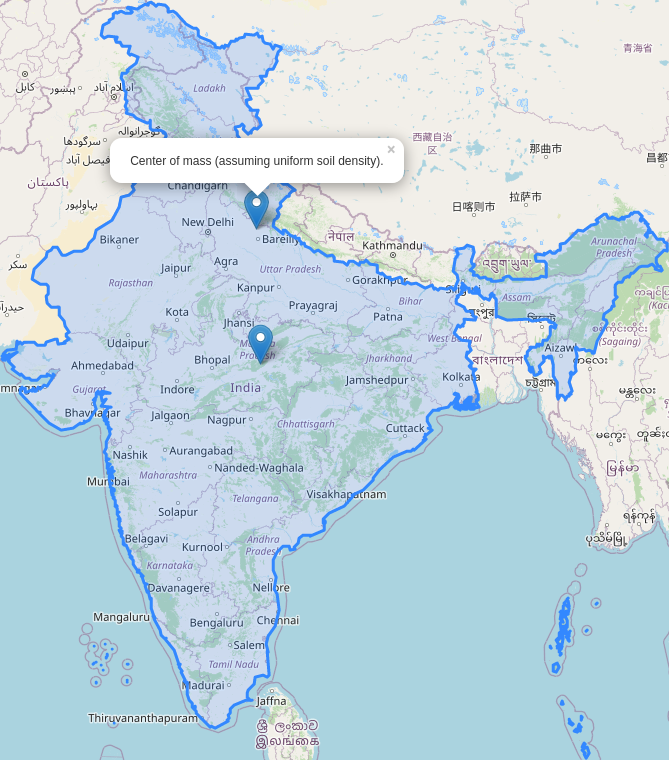

[DEMO](https://dilawar.github.io/map-india-center/)

This repository estimates centroid of India and its center of mass. Centroid is
a rather simple concept: draw the boundary of India on a paper and find the
center. 

The center of mass is slightly more complicated to compute. If you bake a cake
in the shape of India and with most of its permanent 3D features. Now you want
to keep the cake on top of your finger tip in a balanced position, where would
you keep your finger? Think yourself as Krishna who wants to lift the country
on this finger tip (in a balanced position). That location is center of mass of
the country.

Lets do the easy part first.

# Centroid of India

1. Using the boundary given in `./india-composite.geojson`, create
   multi-polygon. There are more than one polygon. The largest one is the
   mainland India and a few others are islands.
2. Compute the centroid. Note that the centroid value will be different if
   different projections are used. Here we are treating it as a simple 2D
   geometry problem: given the coordinates, compute the centroid.
3. Each polygon can a different centroid. We compute the weighted average of
   all centroids (area of the polygon being the weight).

We get the following coordinate for the centroid. This is computed using
`./compute_centroid.py` script using `gdal` python bindings.



[Centroid on Open Street Map](http://www.openstreetmap.org/?mlon=79.3426&mlat=28.6731&zoom=8)


# Center of Mass of India

The center of mass of India is much more complicated to compute. We need to
know the elevation data as well. We will assume that density of the soil,
rocks and other elevations are the same! If you have any information on the
distribution of soil density, let me know.

India specific SRTM data is downloaded from
http://srtm.csi.cgiar.org/srtmdata/. It is kept in `./srtm_raw_data/` folder. I
tried to find this data on ISRO website but I coudn't. If you know the source,
please let me know by opening an issue on this site.

After downloading the data and unzipping them, I merge all tiles together. I
clip the resultant one giant tile using the boundary file
(`./india-composite.geojson`). The final TIF file is huge and not included in
this repository. 

For easy visualization of the elevation profile, I translated the raster
geotiff file to a png with 1/100th of the resolution. The pixel values are also
`stretched` for easy display. Brighter the pixel, higher the elevation.  __DO
NOT USE THIS PNG FILE FOR COMPUTING ANYTHING.__



After this, computing the center of mass is easy. For each pixel, the elevation
becomes the weight (in arbitrary units).  There are total 1,277,331,627 in my
dataset (roughly equal to the population of the country!).

On 2020-06-14, I found the following coordinates: [28.6731,79.3426, See it on
Open Street
Map](http://www.openstreetmap.org/?mlon=79.3426&mlat=28.6731&zoom=8)

Finally, here are both centroid and center of mass of the country.



## Pipeline

First install the following dependencies. I am on OpenSUSE 15.1 but this also
worked on Ubuntu 18.04 and should work on any relatively recent Linux.

1. cmake (version 3.4 or higher)
2. gdal
3. unzip
4. gawk

To run the pipeline,

```
$ cmake .
$ make 
```

__Technical note__ I computed the center of mass by converting the raster file
to a simple CSV based grid file (30 GB in size!) and using `gawk` to compute
the mean. `gawk` took ~7 minutes on my laptop to finish the job! 

## Data repository

1. The raster GeoTIFF can be downloaded from  https://doi.org/10.6084/m9.figshare.12479306.v2

## Notes

### Raster information using `gdalinfo`

```
Driver: GTiff/GeoTIFF
Files: _build/india.clipped.tif
Size is 35079, 36413
Coordinate System is:
GEOGCRS["WGS 84",
    DATUM["World Geodetic System 1984",
        ELLIPSOID["WGS 84",6378137,298.257223563,
            LENGTHUNIT["metre",1]]],
    PRIMEM["Greenwich",0,
        ANGLEUNIT["degree",0.0174532925199433]],
    CS[ellipsoidal,2],
        AXIS["latitude",north,
            ORDER[1],
            ANGLEUNIT["degree",0.0174532925199433]],
        AXIS["longitude",east,
            ORDER[2],
            ANGLEUNIT["degree",0.0174532925199433]],
    ID["EPSG",4326]]
Data axis to CRS axis mapping: 2,1
Origin = (68.162499999999994,37.097499999999997)
Pixel Size = (0.000833333333333,-0.000833333333333)
Metadata:
  AREA_OR_POINT=Area
Image Structure Metadata:
  INTERLEAVE=BAND
Corner Coordinates:
Upper Left  (  68.1625000,  37.0975000) ( 68d 9'45.00"E, 37d 5'51.00"N)
Lower Left  (  68.1625000,   6.7533333) ( 68d 9'45.00"E,  6d45'12.00"N)
Upper Right (  97.3950000,  37.0975000) ( 97d23'42.00"E, 37d 5'51.00"N)
Lower Right (  97.3950000,   6.7533333) ( 97d23'42.00"E,  6d45'12.00"N)
Center      (  82.7787500,  21.9254167) ( 82d46'43.50"E, 21d55'31.50"N)
Band 1 Block=35079x1 Type=Int16, ColorInterp=Gray
```
